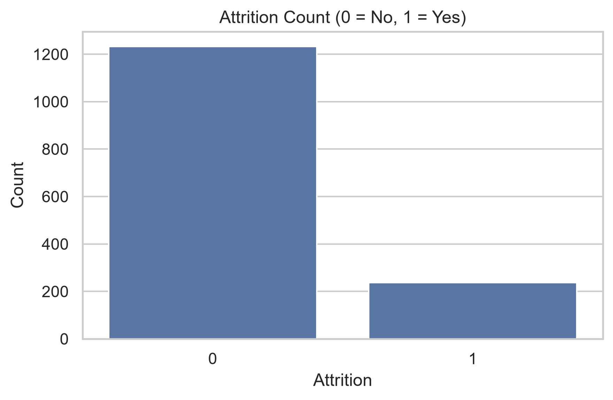
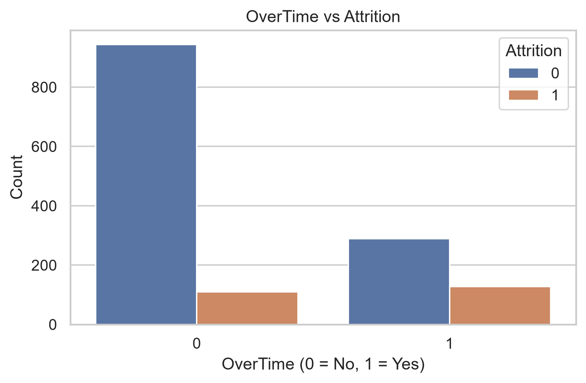
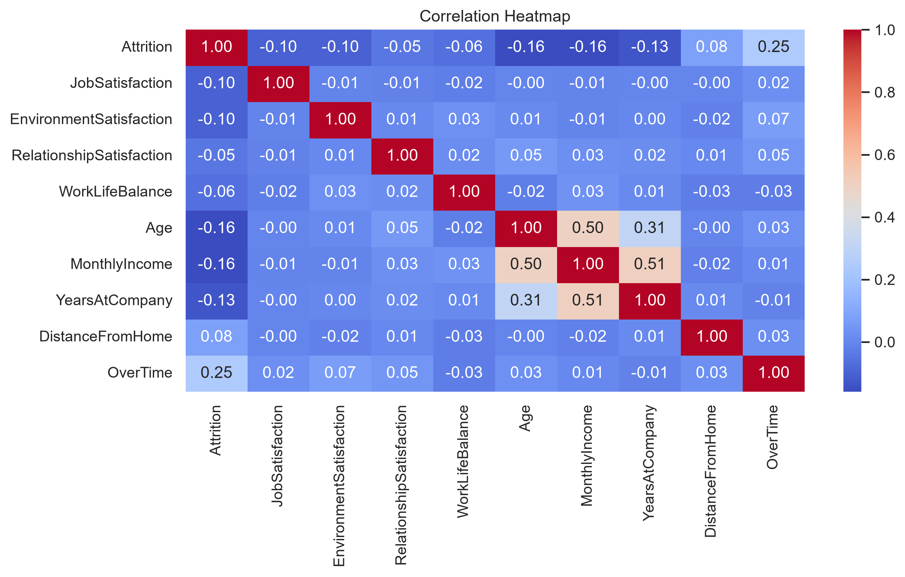

# HR Employee Attrition Analysis and Prediction

## 📌 Project Overview
This project analyzes employee attrition using the IBM HR Analytics dataset. The goal is to identify key factors influencing employee turnover and build a predictive model to estimate whether an employee is likely to leave the company.

The project follows a full data analytics workflow including data cleaning, exploratory data analysis (EDA), visualization, statistical testing, and machine learning.

---

## 🎯 Objectives
- Identify key factors affecting employee attrition
- Analyze relationships between job satisfaction, income, overtime, and attrition
- Perform statistical hypothesis testing
- Build a predictive model for employee attrition

---

## 📊 Dataset
- Source: IBM HR Analytics Employee Attrition Dataset (Kaggle)
- Records: ~1,470 employees
- Features: Demographics, job roles, satisfaction metrics, income, work conditions

---

## 🛠️ Tools & Technologies
- Python
- Pandas
- NumPy
- Matplotlib
- Seaborn
- Scikit-learn
- SciPy

---

## 🔍 Workflow

### 1. Data Preprocessing
- Loaded and explored dataset structure
- Checked missing values and data types
- Selected relevant features for analysis
- Converted categorical variables into numerical format

### 2. Exploratory Data Analysis (EDA)
- Attrition distribution analysis
- Job satisfaction vs attrition
- Overtime impact analysis
- Income distribution comparison
- Correlation heatmap analysis

### 3. Statistical Analysis
- Pearson correlation analysis
- Hypothesis testing to determine significant relationships
- Evaluation of satisfaction factors on attrition

### 4. Machine Learning Model
- Logistic Regression model
- Train-test split evaluation
- Performance evaluation using:
  - Accuracy Score
  - Classification Report

---

## 📈 Key Insights
- Employees with lower job satisfaction are more likely to leave
- Overtime has a strong relationship with higher attrition rates
- Lower monthly income is associated with increased turnover
- Work-life balance and environment satisfaction significantly affect retention

---

## 🤖 Model Performance
- Model: Logistic Regression
- Output: Binary classification (Attrition: Yes/No)
- Evaluation metrics: Accuracy, Precision, Recall, F1-score

---

## 📌 Future Improvements
- Try advanced models (Random Forest, XGBoost)
- Hyperparameter tuning for better accuracy
- Deploy model using Flask or Streamlit
- Build interactive dashboard for HR insights

## Visualizations

### Attrition Count


### Overtime vs Attrition


### Correlation Heatmap


---

## 📂 How to Run
```bash
pip install -r requirements.txt
python analysis.py
